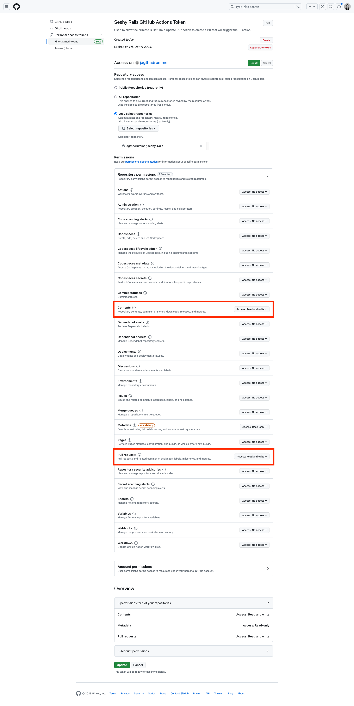

# bullet-train-co/create-upgrade-pr

A GitHub action to create a PR to upgrade your Bullet Train application from the [starter repo](https://github.com/bullet-train-co/bullet_train).

When used in a workflow this action will:

1. Checkout your application code.
2. Configure the starter repo as the `bullet-train` remote
3. Merge in the tag for the version number that was passed in. (Merges the latest version if no version is passed.)
4. Create a Pull Request containing the changes required for the upgrade. If there are merge conflicts they will be included in the PR and you'll need to resolve them.

## Usage

```yaml
- name: Create upgrade PR
  uses: bullet-train-co/create-upgrade-pr@v1
```

## Workflow Permissions

For this action to work you must explicitly allow GitHub Actions to create pull requests. This setting can be found in a repository's settings under Actions > General > Workflow permissions.

For repositories belonging to an organization, this setting can be managed by admins in organization settings under Actions > General > Workflow permissions.

## Action Inputs

| Name | Description | Default |
| --- | --- | --- |
| `token` | `GITHUB_TOKEN` (permissions `contents: write` and `pull-requests: write`) or a `repo` scoped [Personal Access Token (PAT)](https://docs.github.com/en/github/authenticating-to-github/creating-a-personal-access-token). | `GITHUB_TOKEN` |
| `versionNumber` | The version that you want to upgrade to. | If not supplied we'll used the latest published version. |

### Why you should use a PAT

If you have any workflows set up that are triggered when a PR is created you'll want to setup a Personal Access Token and pass that in.
This is due to a limitation on the default `GITHUB_TOKEN` which is unable to trigger additional workflows.

### Creating a PAT

When creating a [Personal Access Token (PAT)](https://docs.github.com/en/github/authenticating-to-github/creating-a-personal-access-token) you have two choices.

1. Use the new "Fine-grained tokens" when creating your token. You'll need to select the appropriate repo(s), and set "Contents" and "Pull Request" permissions to be read/write.
2. Create a "classic" token with the `repo` scope. This token will have access to _ALL_ your repos, so we don't really recommend it.

Once you've generated your token add it to your repository secretes as `PAT`.

Here's a screenshot of setting up a fine-grained token:



## Action Outputs

None

TODO: Maybe we should output some things?

## Reference Example

Here is a complete example worklow. In fact, this is exactly the workflow that we ship in the starter repo.

```yaml
name: "Create Bullet Train Upgrade PR"
on:
  workflow_dispatch:
    inputs:
      versionNumber:
        description: 'Version Number (latest if blank)'
        type: string

jobs:
  update:
    runs-on: ubuntu-latest
    steps:
      - name: Create upgrade PR
        uses: bullet-train-co/create-upgrade-pr@v1
        with:
          versionNumber: ${{ inputs.versionNumber }}
          token: ${{ secrets.PAT }}
```
